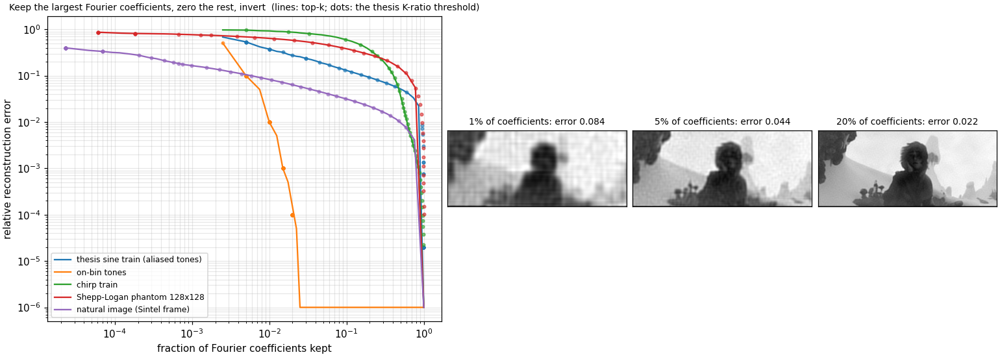
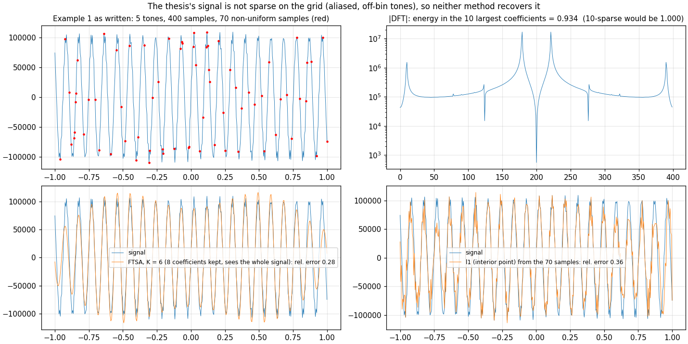
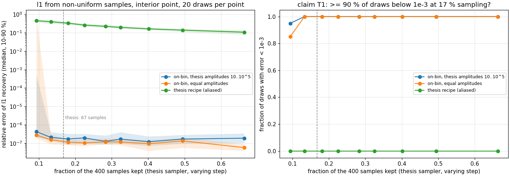
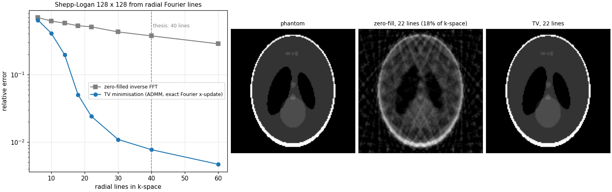
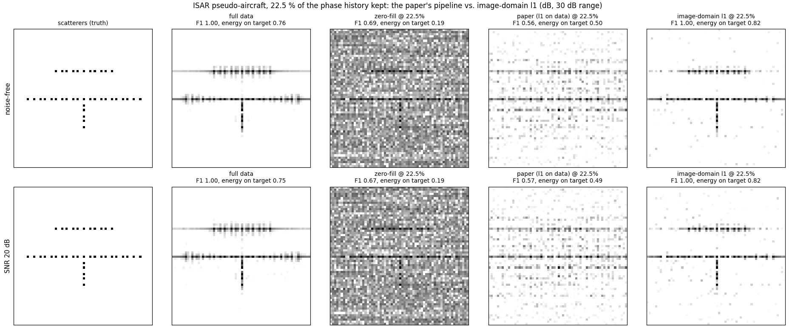
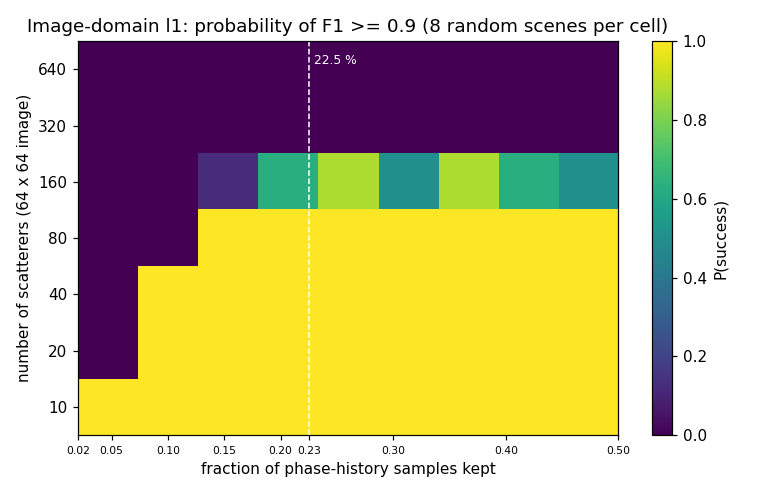
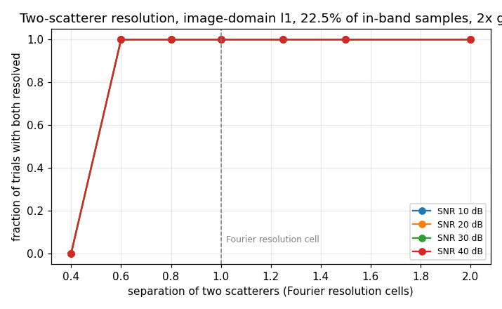
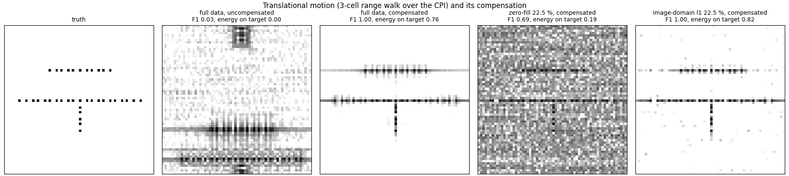
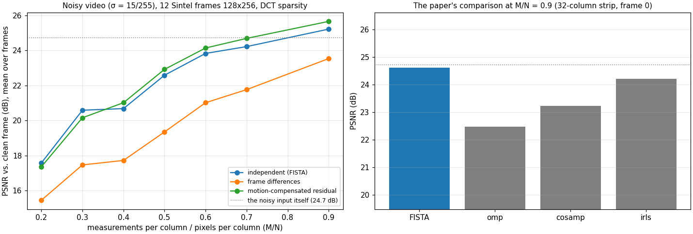

# compressive-imaging

[](https://github.com/JCMontalbo/compressive-imaging/actions/workflows/ci.yml)

My master's thesis (UT Rio Grande Valley, 2016) was about keeping less. Take a signal's Fourier data,
keep only the coefficients whose magnitude clears a threshold, zero the rest, and invert — and show that
you lose very little. I derived the radar scattering model from Maxwell's equations, ran the thresholding
on signals and images, tried ℓ₁ recovery from non-uniform samples with an off-the-shelf solver, and closed
by saying what came next: *"learn more about interior point algorithms so as to try and develop our own
compressive sensing algorithm that can be utilized within the radar system process."*

This repository is that next step. I wrote the pass/fail lines into git before running anything
([docs/plan.md](docs/plan.md)), so what follows is what I found, misses included.

1. **The solvers, written from scratch** and tested against theory — ISTA, FISTA, OMP, CoSaMP, IRLS,
   ADMM basis pursuit, a log-barrier interior-point method for basis pursuit, and ADMM total variation
   with an exact Fourier-domain update.
2. **The thesis, reproduced and carried through** — the thresholding idea measured as the rate–distortion
   curve it is, the thesis's own test signals revisited, and its ℓ₁ and TV experiments redone with my own
   solvers.
3. **The radar imaging the thesis pointed at** — turntable ISAR built from the thesis's scattering model
   and sampled compressively, with the one decision that makes or breaks it: sparsity has to be assumed in
   the image, not the data. Same 22.5% of the samples: F1 0.54 → 0.96, the full-data ceiling.
4. **A 2015 noisy-video paper I co-authored, reproduced and extended** with frame differences and
   motion-compensated residuals using the flow from
   [optical-flow-inverse](https://github.com/JCMontalbo/optical-flow-inverse).

Every number below comes from a script in `scripts/`; 20 tests, CI on Python 3.10–3.13.

Sources: J. Montalbo, *Compressive Sensing and Radar Imaging*, MS thesis, UTRGV 2016 ·
Zhao, Montalbo, Li, Sun, Qiao, *Compressive sensing for noisy video reconstruction*, Proc. SPIE 9484 (2015).

---

## 2. The thesis, reproduced and carried through

### The idea: keep the largest Fourier coefficients

This is transform coding — the principle behind JPEG and MP3 — and the claim in my abstract was a
rate–distortion claim: *certain transformations allow minimal data acquisition and high reconstruction
rate.* Here it is measured, with my K-ratio threshold (keep |F| ≥ max|F|/K) and the plain top-k rule side
by side:



| keep this fraction of the Fourier coefficients → relative error | 1% | 5% | 20% |
|---|---|---|---|
| natural image (a Sintel frame) | **0.084** | **0.044** | 0.022 |
| on-bin tones (10 of 400 coefficients carry everything) | 0.010 | 0.000 | 0.000 |
| my §4.1 sine train (aliased, off-bin tones) | 0.375 | 0.188 | 0.088 |
| chirp train | 0.927 | 0.763 | 0.330 |
| Shepp–Logan phantom | 0.650 | 0.477 | 0.270 |

A natural image reconstructs to 8% error from **1%** of its Fourier coefficients and 4% from 5% — the
thermal-image and Lena results from the thesis, with numbers on them. The K-ratio rule (dots) follows top-k
(lines) because it selects coefficients in the same order. The same curve shows where the idea stops:
sharp-edged images like the phantom are not Fourier-compressible — their sparse domain is the gradient,
which is why my chapter 6 reaches for total variation on exactly that image — and chirps are not
compressible in any fixed basis. And one distinction I drew myself on page 41: choosing which coefficients
to keep requires the whole signal, so this is compression after acquisition. Recovering from *partial*
acquisition is the separate question of chapter 6 and of Part 3 below.

### My §4.1 test signals



The thesis's test signals are five tones with amplitudes 10…10⁵ and frequencies aᵢ·rᵢ^{rᵢ} — up to
10¹⁴ rad/s on 400 samples over [−1, 1]. Aliased that many times over, the discrete signal is five tones at
off-bin frequencies, and its ten largest DFT coefficients hold 93.4% of its energy, not 100%. It is not
sparse on the grid, which is why both methods struggled with it:

| on Example 1 | relative error |
|---|---|
| thresholding, K = 6 (8 coefficients kept; sees the whole signal) | 0.28 |
| ℓ₁ from 70 non-uniform samples (interior point, the setting I used `l1eq_pd` for) | 0.36 |

The thesis reports 2.5e-5 for the ℓ₁ step, and notes that "in order for the algorithm to work it needs to
have the original signal." Now I know why: the recovery was never from the samples alone, because on this
signal it couldn't be.



With tones that are actually sparse on the grid, my sampler and an interior-point ℓ₁ solve do exactly
what I hoped for in 2016: relative error ~1e-7 in **100% of draws down to 13% of the samples**, and 95% of
draws at 9%. The 10⁴ amplitude range in my signals does not trouble ℓ₁ at all — though it does break the
fixed-ratio threshold, which keeps 2 of the 10 coefficients (error 0.10). My pre-registered claim T1
(≥ 90% of draws below 1e-3 at 17%) holds for sparse signals and fails for the §4.1 recipe.

Also as in the thesis: chirp trains are not Fourier-sparse (thresholding 0.61, ℓ₁ 1.0 — both fail); the
Walsh–Hadamard variant is far worse than the DFT for tones (0.31 with 116 coefficients vs 1e-14 with 10).



The thesis's last experiment (§6.2, the Candès–Romberg–Tao phantom from radial Fourier lines, which I ran
through `l1-magic`) with my own TV solver: 18 lines → 5% error, **22 lines → 2.4%**, 40 lines → 0.8%,
against 51% / 37% for zero-filling. The exact Fourier-domain x-update ([`tv_fourier`](csi/solvers.py)) is
what makes this converge; a generic conjugate-gradient inner solve did not.

## 3. The radar imaging the thesis pointed at

Chapter 3 of the thesis derives the scattered field from the scalar wave equation — Lippmann–Schwinger,
then the Born and far-field approximations — and stops there. [`csi/isar.py`](csi/isar.py) carries it
through to an image: turntable ISAR, a generic S-band stepped-frequency radar (3.0–3.384 GHz, 0.39 m range
cell, 64 pulses over the aperture that makes cross-range cells the same size), an aircraft-like layout of
39 point scatterers, polar→rectangular interpolation, image by 2-D FFT. Compressive sampling: keep a
uniformly random 22.5% of the phase-history samples.

The question the thesis never got to ask: *where* is the sparsity? Two pipelines on the same samples.



| pipeline, 22.5% of samples | F1 (peaks within one cell of a true scatterer) | energy on the true scatterers |
|---|---|---|
| full data (the ceiling: a few scatterers share a cell) | 0.96 | 0.66 |
| zero-filled inverse FFT | 0.61 | **0.16** |
| ℓ₁ applied to the *data*, then image | 0.54 | 0.42 |
| **ℓ₁ applied to the *image*** (same samples) | **0.96** | **0.74** |
| … at 20 dB SNR | 0.96 | 0.73 |

The phase history is a sum of 39 complex exponentials and is not sparse: its 39 largest samples hold 15% of
its energy. The image is exactly 39-sparse. ℓ₁ applied to the data has nothing to find — the sparsest data
consistent with a random subset of samples is just those samples with zeros elsewhere, which is
zero-filling, and its aliasing noise is what fills the third panel. Treat the kept samples as partial
Fourier measurements of the image instead, and the target comes back at the full-data ceiling, with or
without noise.

Against my pre-registered criteria: H2 (image-domain ℓ₁ at 22.5%: F1 ≥ 0.9, localisation < 1 cell) holds,
noise-free and at 20 dB; H3 (data not sparse in the basis used, image is) holds; H1 said the data-domain
pipeline would score F1 < 0.5 and it scored 0.54, so H1 is not met by its number — the peak detector I
chose is lenient, and the line stays where I set it.



The phase transition of the image-domain pipeline on random scenes: 80 scatterers need ≥ 10% of the
samples, 160 need ~20% and are unreliable, 320+ fail at every rate tried (FISTA, 200 iterations, fixed λ —
this is the pipeline's transition, not the information-theoretic one). A 40-scatterer target sits well
inside the feasible region at 22.5%.



Two equal scatterers on a 2× oversampled image grid with only the in-band k-samples measured, so that
resolving below one cell is a real question and not a grid artefact: ℓ₁ resolves them **0.6 Fourier cells
apart** at every SNR from 10 dB, and not at 0.4. On-grid, noise-only — the classic sparse super-resolution
result.



A 3-cell translational range walk over the CPI smears the full-data image to F1 0.03. Compensating the
walk on the *kept* samples and then running image-domain ℓ₁ gives F1 0.96, the ceiling again; zero-filling
compensated stays at 0.61.

## 1. Solvers, from scratch

[`csi/solvers.py`](csi/solvers.py) — each with a test in [`tests/test_solvers.py`](tests/test_solvers.py)
against a property it must have:

| solver | tested against |
|---|---|
| FISTA | Beck–Teboulle's bound F(xₖ) − F* ≤ 2L‖x₀ − x*‖²/(k+1)², every iteration |
| ISTA | monotone descent; ~1% behind FISTA's objective after 6,000 iterations |
| OMP | exact recovery of an 8-sparse vector from 64 Gaussian measurements of 256 |
| CoSaMP | exact recovery; error proportional to noise |
| IRLS, ADMM basis pursuit, interior point | agree with each other to 1e-4; interior point's duality gap < 1e-8 |
| ADMM-TV | denoises a piecewise-constant image below the noise level |

The interior-point method (primal log barrier, Newton with the KKT system reduced by elimination, Boyd &
Vandenberghe ch. 10–11) is the algorithm behind `l1-magic`'s `l1eq_pd` — the thing my thesis said I wanted
to learn. It converges in ~70 Newton steps on the thesis-sized problems.

## 4. The 2015 video paper, reproduced and extended

A conference paper I co-authored (second author). Its setting: the video is degraded by Gaussian noise
(σ = 15/255), each column of each frame is measured by a Gaussian matrix with M of N rows (the paper:
230 of 256), the column is assumed sparse in the DCT, and FISTA ("FGbCS") is compared with OMP, CoSaMP,
IRLS on PSNR against the clean frame. Reproduced on 12 Sintel frames (128 × 256), since the *salesman*
clip the paper used is no longer hosted.



| M/N = 0.9, identical measurements | PSNR |
|---|---|
| **FISTA** (the paper's method) | **24.6 dB** |
| IRLS | 24.2 |
| CoSaMP | 23.2 |
| OMP | 22.5 |
| the noisy input, untouched | 24.7 |

The paper's ranking reproduces — FISTA > IRLS > CoSaMP > OMP, in that order. Its gain does not: on a
textured frame, column-wise DCT sparsity is too weak a prior to denoise with. The best λ gives +0.5 dB over
the noisy input at M/N = 0.9 and sits 2 dB *below* it at M/N = 0.5 (λ swept 0.002–0.2; 0.02 is the
optimum and is what the curves use). The ~4 dB gain we reported on *salesman* — a smooth, low-texture
clip — does not carry over to this footage.

**Time and motion.** Recovering frame *differences* against the previous reconstruction is worse than
independent recovery at every rate (drift, plus a residual that is no sparser in a column DCT). Predicting
the frame along the flow from `optical-flow-inverse` and recovering only the residual is the best of the
three, by **0.3–0.5 dB** from M/N = 0.4 upward. My pre-registered target (30 dB with ≥ 30% fewer
measurements) is not reached by any scheme, because the sparsity model cannot denoise this far. Motion
helps a little; the model is the bottleneck.

## Run it

```bash
pip install -e ".[dev]"
pytest                          # 20 tests, ~7 s
python scripts/run_thesis.py    # Part 2, ~1 min
python scripts/run_isar.py      # Part 3, ~1 min
python scripts/run_video.py     # Part 4, ~1 min; needs optical-flow-inverse installed and its Sintel frames
```

MIT license.
